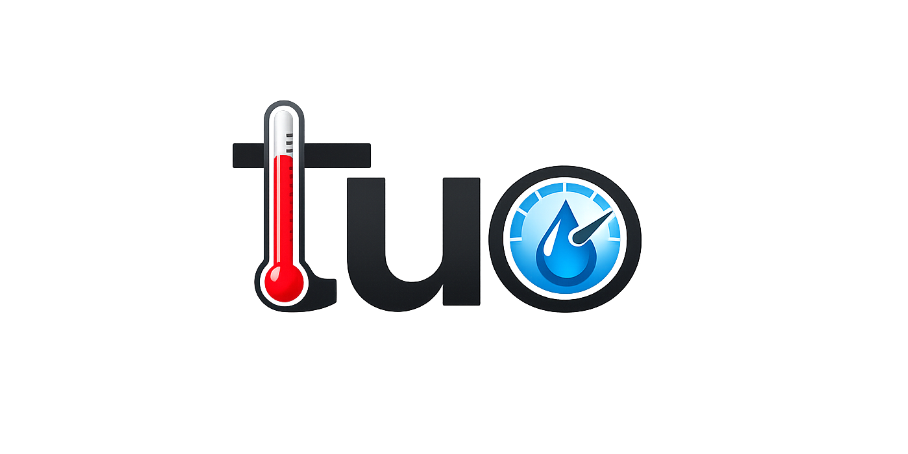

# TUO™ - Temperatura e Umidità Ovunque

> **"Il TUO sistema di misurazione, per misurare Temperatura e Umidità Ovunque"**

---

## Cos'è TUO?
**TUO** è un sistema di monitoraggio ambientale statico basato su architettura Arduino. Dopo l'esperienza di **AMO** (App di Musica Offline), il team si è spostato sull'hardware per creare una stazione di rilevamento solida e affidabile. 

Il nome **Ovunque** riflette la versatilità d'installazione: dalla scrivania del tuo ufficio allo scaffale del tuo garage, **TUO** monitora costantemente le condizioni climatiche del tuo spazio vitale.

---

## Caratteristiche del Sistema
* **Monitoraggio Statico Dedicato:** Progettato per restare attivo 24/7 nella tua postazione.
* **Precisione Digitale:** Analisi dei dati termici e igrometrici in tempo reale.
* **Monitoraggio Temperatura:** LED RGB di stato per segnalare in tempo reale il livello di comfort ambientale.
* **Identità Unica:** Un progetto che unisce utilità tecnica e un brand riconoscibile.

---

## TUO & CO.
Il progetto è stato ideato, sviluppato e assemblato da:
* **Alberto Pozzali**
* **Matteo Pelizzari**
* **Alessandro Spada**
* **Mattia Tran**

---

## Proprietà Intellettuale e Licenza

### Brand & Design
**TUO© 2026 TUO&CO. Tutti i diritti riservati.**

Il nome **"TUO"**, il logo e lo slogan **"Temperatura e Umidità Ovunque"** sono proprietà intellettuale esclusiva degli autori sopra citati. 
* **Vietato** l'utilizzo del nome e del marchio per progetti di terzi.
* **Vietata** la riproduzione del brand o dello slogan senza esplicito consenso scritto.
